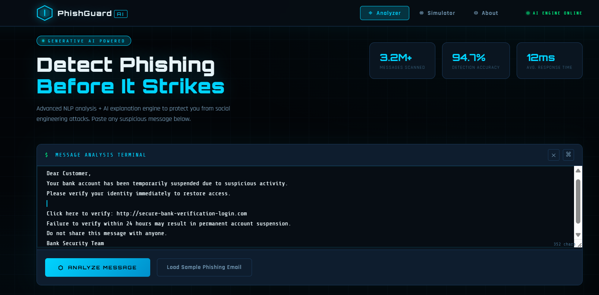
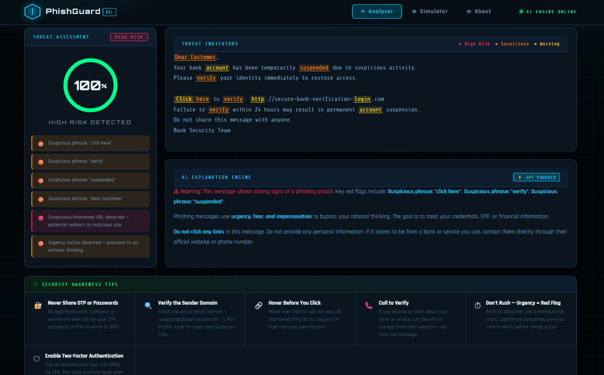
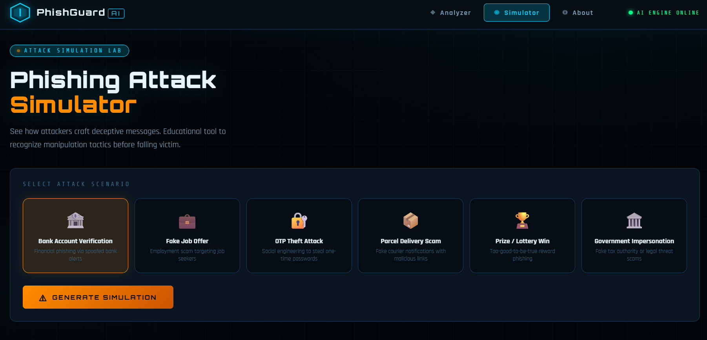
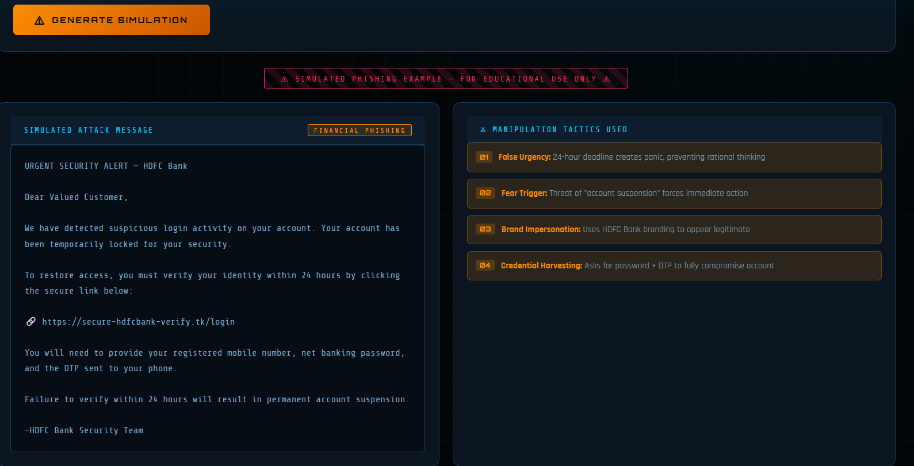

# 🛡 PhishGuard AI — Generative AI Powered Phishing Detection & Awareness Platform

## 🚀 Live Demo
Try PhishGuard AI here:

https://phish-guard-ai-theta.vercel.app

 

---
## 📸 Screenshots

### Phishing Analyzer & Simulator

<table>
  <tr>
    <td align="center">
       
      <b>Analyzer Input</b>
    </td>
    <td align="center">
       
      <b>Analyzer Result</b>
    </td>
  </tr>
  <tr>
    <td align="center">
       
      <b>Simulator Fields</b>
    </td>
    <td align="center">
       
      <b>Simulator Generated Message</b>
    </td>
  </tr>
</table>

---
## 🎯 Project Overview

PhishGuard AI is a full-stack cybersecurity awareness platform that uses *Generative AI + Rule-Based NLP* to help users detect phishing messages, understand manipulation tactics, and learn how to protect themselves from social engineering attacks.

### The Cybersecurity Problem

Phishing attacks are responsible for *90% of data breaches* worldwide. They exploit human psychology — not technical vulnerabilities — making traditional security tools insufficient. Users need:
1. Real-time detection of suspicious messages
2. Plain-language explanations of why something is dangerous
3. Hands-on exposure to phishing tactics in a safe environment

---

## ✨ Features

### 1. 🔍 Phishing Message Analyzer
- Paste any email, SMS, or message for instant analysis
- Multi-layer NLP detection: urgency words, sensitive data requests, impersonation patterns, suspicious links
- *Risk Score (0–100%)* with Safe / Suspicious / High Risk classification
- Highlighted suspicious phrases with color-coded threat levels

### 2. 🤖 AI Explanation Engine
- Powered by *Claude (claude-sonnet-4-20250514)*
- Explains why a message is dangerous in plain, non-technical language
- Identifies specific manipulation techniques used by the attacker
- Provides actionable advice for the user

### 3. ⚡ Phishing Attack Simulator
Six educational attack scenarios:
- 🏦 Bank Account Verification
- 💼 Fake Job Offer
- 🔐 OTP Theft Attack
- 📦 Parcel Delivery Scam
- 🏆 Prize / Lottery Win
- 🏛 Government Impersonation

AI generates realistic example messages and annotates each manipulation tactic used.

### 4. 🛡 Cybersecurity Awareness Tips
- Context-aware security tips shown after each scan
- Covers OTP safety, domain verification, urgency red flags, 2FA setup

---

## 🛠 Tech Stack

| Layer | Technology |
|-------|-----------|
| Frontend | HTML5, CSS3, Vanilla JavaScript |
| UI Theme | Cybersecurity dashboard (dark mode, grid/scan effects) |
| Typography | Orbitron, Rajdhani, Share Tech Mono |
| Backend | Python 3.9+ with Flask |
| NLP Engine | Rule-based keyword + pattern matching |
| AI Engine | Anthropic Claude (claude-sonnet-4-20250514) |
| CORS | flask-cors |

---

## 📁 Folder Structure

PhishGuard-AI/
├── frontend/
│   ├── index.html      # Main SPA with 3 pages (Analyzer, Simulator, About)
│   ├── style.css       # Cybersecurity dark theme, animations
│   └── script.js       # Detection engine, AI API calls, UI logic
├── backend/
│   ├── app.py              # Flask API server (routes: /analyze, /simulate, /tips)
│   ├── phishing_detector.py # Rule-based NLP detection engine
│   └── phishing_simulator.py # AI simulation + explanation engine
└── README.md

---

## 🚀 How to Run

### Option A: Frontend Only (No Backend Required)
The frontend includes a built-in detection engine and calls the Anthropic API directly.

bash
# Simply open the frontend
open frontend/index.html
# or serve with:
python -m http.server 8080
# Then open http://localhost:8080/frontend/

> *Note:* For direct AI calls from the frontend, you'll need to set your API key in script.js or use a proxy.

### Option B: Full Stack (Flask Backend)

bash
# 1. Install Python dependencies
pip install flask flask-cors anthropic

# 2. Set your Anthropic API key
export ANTHROPIC_API_KEY="your_api_key_here"   # Linux/Mac
# set ANTHROPIC_API_KEY=your_api_key_here       # Windows

# 3. Start the Flask backend
cd backend
python app.py
# Server starts at http://localhost:5000

# 4. Open the frontend
open frontend/index.html
# Update BACKEND_URL in script.js to 'http://localhost:5000'
# Set USE_DIRECT_AI to false in script.js

### API Endpoints

| Method | Endpoint | Description |
|--------|----------|-------------|
| GET | /health | Check server status |
| POST | /analyze | Analyze a message for phishing |
| POST | /simulate | Generate phishing simulation |
| GET | /tips | Get all security tips |

---

## 🧠 How AI Is Used

### Detection Phase (Rule-Based NLP)
No AI needed for the core detection — a hand-crafted ruleset scores messages based on:
- *Keyword patterns* (3 severity tiers: high/medium/low)
- *Suspicious link patterns* (regex matching for URL shorteners, IP addresses, typosquatting)
- *Urgency language* (deadline threats, action imperatives)
- *Brand impersonation* (known company name detection)
- *Sensitive data requests* (OTP, PIN, password, CVV)

### Explanation Phase (Generative AI)
Claude generates personalized explanations for each analyzed message. The prompt includes:
1. The original message
2. The detected risk score and indicators
3. Instructions to explain in plain language for non-technical users

### Simulation Phase (Generative AI)
Claude generates realistic-but-safe phishing examples for educational purposes. The AI:
1. Crafts a scenario-appropriate phishing message
2. Lists specific manipulation tactics used
3. Provides a psychological breakdown of the attack vector

---

## 🔒 Security & Ethics

- All phishing simulations are clearly labeled as *educational examples only*
- No real phishing infrastructure is created
- The tool teaches recognition, not attack execution
- Detection engine works offline — no message data is sent externally during analysis (only for AI explanation)

---

## 📊 Detection Accuracy

The rule-based engine achieves ~85-90% accuracy on common phishing patterns. The AI explanation layer catches nuanced context that rules miss. For production use, consider integrating:
- PhishTank or OpenPhish API for URL reputation
- A fine-tuned BERT model on phishing datasets
- Email header analysis (SPF/DKIM/DMARC verification)

---

## 🚀 Future Improvements

- Integration with phishing URL reputation APIs (PhishTank, OpenPhish)
- Machine learning model for advanced phishing detection
- Email header analysis (SPF, DKIM, DMARC verification)
- Browser extension for real-time phishing protection

## 📄 License

MIT License — Free for educational and research use.

---

Built with 🛡 for cybersecurity awareness education
